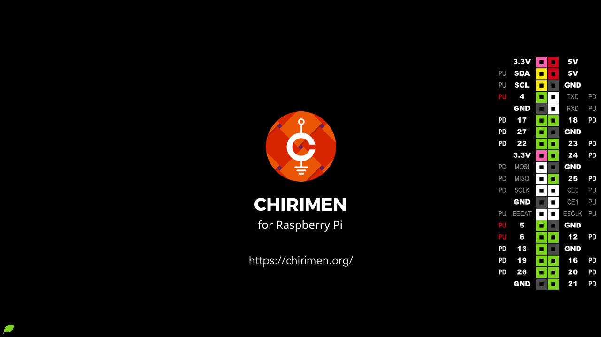

# CHIRIMEN for Raspberry Pi

`CHIRIMEN for Raspberry Pi` is an IoT programing/prototyping environment for bigenners.

Always under construction...

# How To Setup CHIRIMEN Environment on raspbian

Execute [`./setup.sh`](setup.sh) on Raspbian with Desktop.

# View top page content of chirimen environment on github

[Access this page](http://chirimen.org/chirimen/gc/top/) via github pages.

# Files and Directories

- \_gc/
  - ... need update ...
- gc/
  - ... need update ...
- readme.md
  - this file
- release.sh
  - script to make release package
- setup.sh
  - setup script to install CHIRIMEN environment on raspbian

# How To Release

Refer https://github.com/chirimen-oh/chirimen/wiki/Release

# Licenses

- source codes
  - [MIT License](https://opensource.org/licenses/mit-license.php)
- other files (.png files, document files)
  - [CC by SA 4.0](https://creativecommons.org/licenses/by-sa/4.0/)
